# Prüfungsmodus

Wenn du die **TI-Nspire™ CAS-App von Texas Instruments auf dem iPad** in einer Klausur verwendest, startest du dafür den Prüfungsmodus. Hier erfährst du, wie du ihn vorbereitest, aktivierst und nach der Prüfung wieder beendest.

## Was ist der Prüfungsmodus?

Der Prüfungsmodus beschränkt die App auf die für die Prüfung vorgesehenen Funktionen. Deine bereits gespeicherten Ordner und Dokumente sind währenddessen nicht zugänglich. Nach dem Beenden stehen sie wieder zur Verfügung. Die App-Selbstsperre hält das iPad während der Sitzung in der Prüfungsumgebung.

!!! info "Die Einstellungen gibt deine Lehrkraft vor"
    Welche Funktionen erlaubt sind, hängt von der Prüfung ab. Übernimm deshalb genau den Testcode oder die Einstellungen deiner Lehrkraft. Der Prüfungsmodus bedeutet nicht automatisch, dass CAS ausgeschaltet ist.

Weitere Informationen findest du in der [TI-Anleitung zum Prüfungsmodus](https://education.ti.com/html/eguides/nspire/EG_Nspire/DE/content/eg_ipadapp/m_testmode/m_testmode.HTML).

## Vor der Prüfung

- Lade dein iPad ausreichend auf und speichere deine bisherigen Arbeiten.
- Halte den **Testcode deiner Lehrkraft** bereit, falls ihr einen verwendet.
- Prüfe in den iPad-Einstellungen bei **TI-Nspire CAS → Fotos**, ob der Fotozugriff erlaubt ist. Je nach iPadOS-Version findest du die App unter **Apps**. Der Zugriff wird für die Prüfungsmodus-Zusammenfassung benötigt.
- Deaktiviere WLAN und Bluetooth, wie es TI in seiner Kurzanleitung beschreibt. Beachte bei schulisch verwalteten Geräten die Anweisungen deiner Lehrkraft.

Die Vorbereitung beschreiben das [TI-Handbuch](https://education.ti.com/html/eguides/nspire/EG_Nspire/DE/content/eg_ipadapp/m_testmode/tm_prepare_ipad.HTML) und die [TI-Kurzanleitung](https://education.ti.com/de/kundenservice/haeufige-fragen/ti-nspire-apps-fur-ipad/82045).

### Fotozugriff erlauben

Falls beim Start die folgende Meldung erscheint, tippe auf **Einstellungen**:

[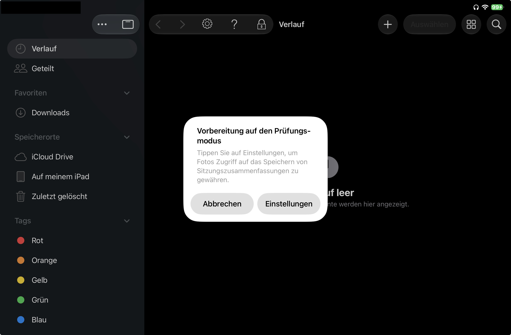{ loading=lazy }](../img/Fotofreigabe1.png)

Öffne dort den Eintrag **Fotos**:

[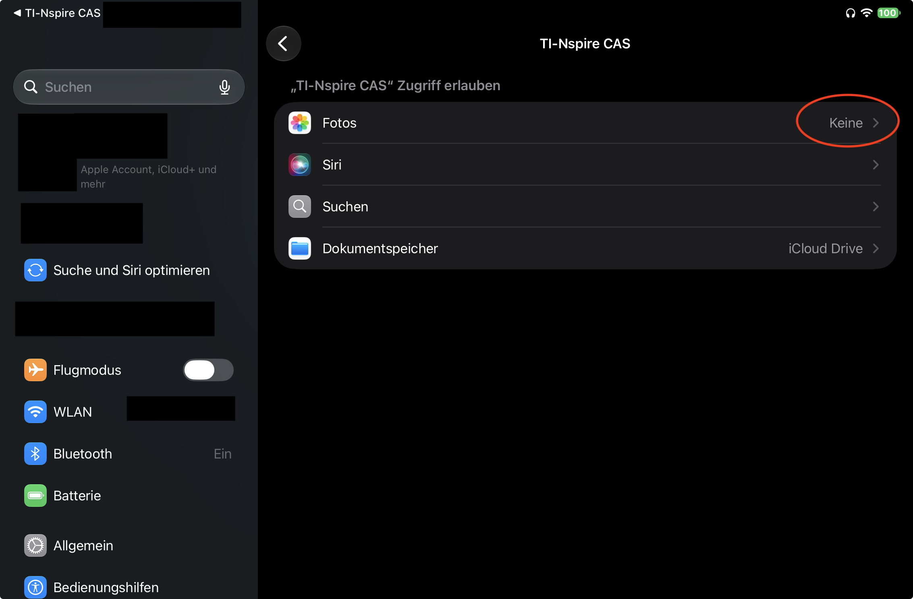{ loading=lazy }](../img/Fotofreigabe2.png)

Erlaube der App den Fotozugriff. In diesem Beispiel wird **Voller Zugriff** gewählt und anschließend mit **Vollen Zugriff erlauben** bestätigt:

[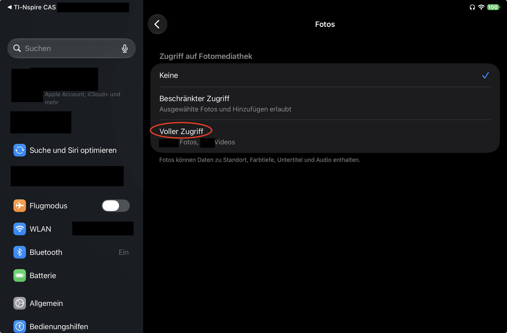{ loading=lazy }](../img/Fotofreigabe3.png)

[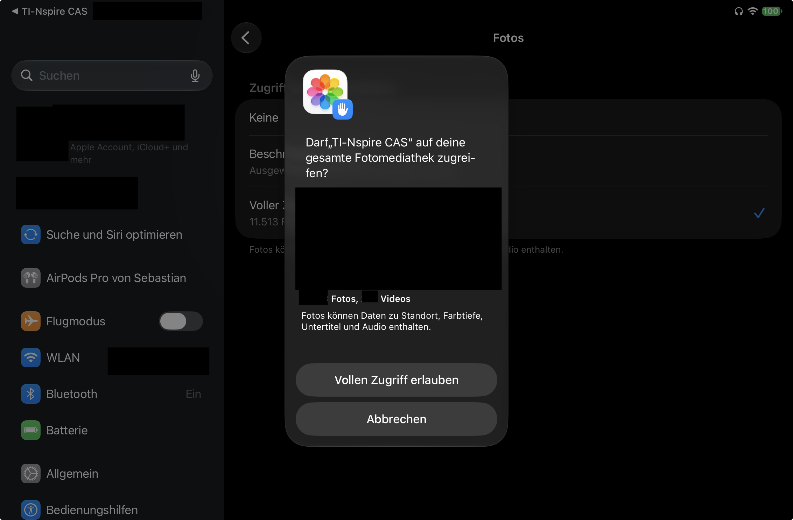{ loading=lazy }](../img/Fotofreigabe4.png)

Wechsle danach zurück zur TI-Nspire CAS-App.

## Prüfungsmodus aktivieren

Öffne die TI-Nspire CAS-App und tippe auf das **Schlosssymbol**:

[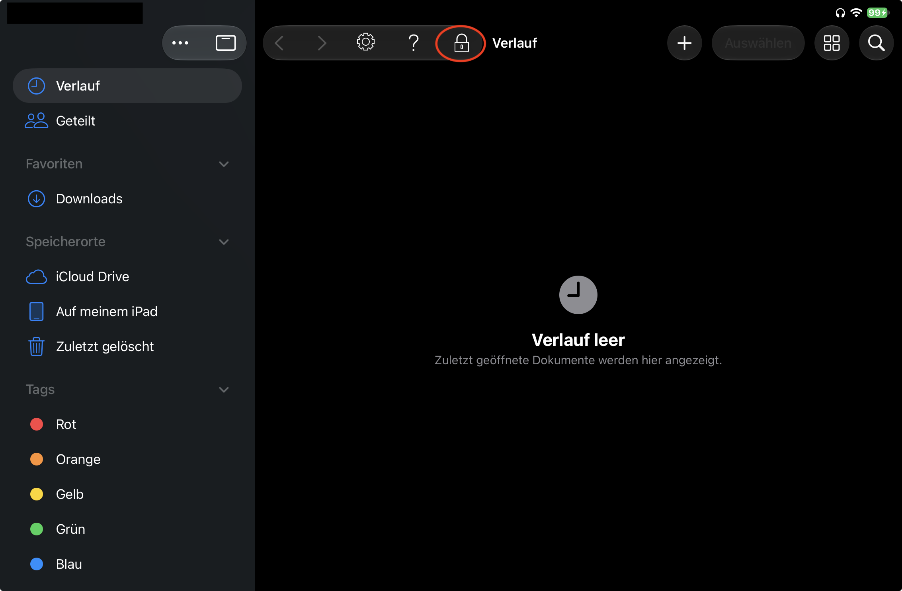{ loading=lazy }](../img/Modusstarten.png)

Du hast zwei Möglichkeiten. Die Bilder lassen sich durch Antippen vergrößern.

### Mit einem Testcode

!!! tip "Den Code deiner Lehrkraft verwenden"
    Die Bilder zeigen verschiedene Beispielcodes. Übernimm für deine Klausur immer den Code deiner Lehrkraft und prüfe die zugehörigen Einstellungen.

1. Wähle **Testcode eingeben**.

    [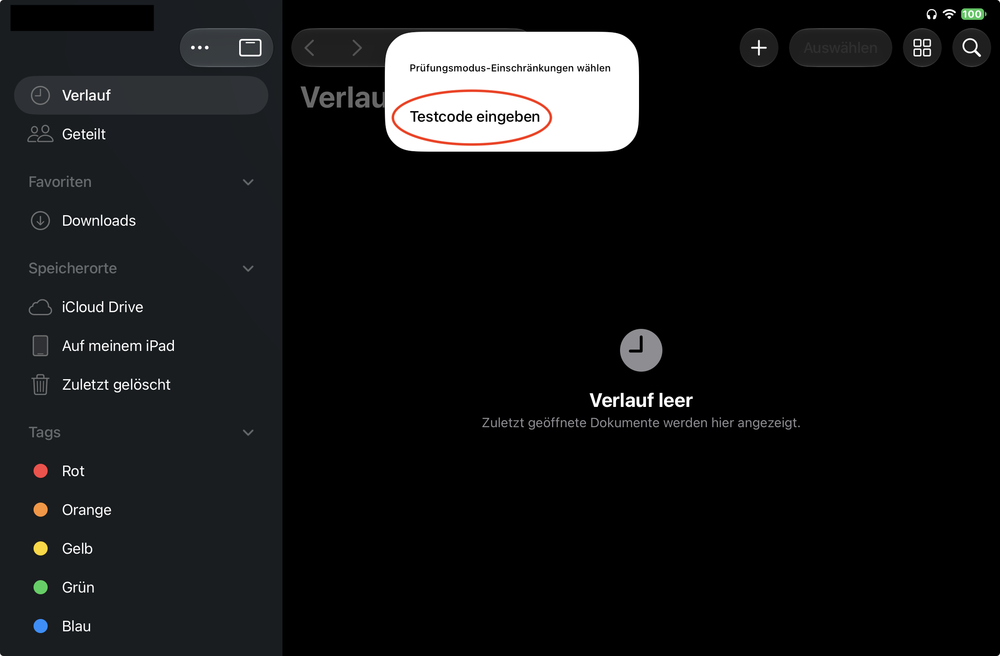{ loading=lazy }](../img/Testcode1.png)

2. Tippe in das Codefeld und trage den **achtstelligen Code deiner Lehrkraft** ein. Ein grünes Häkchen zeigt, dass der eingegebene Code gültig ist.

    [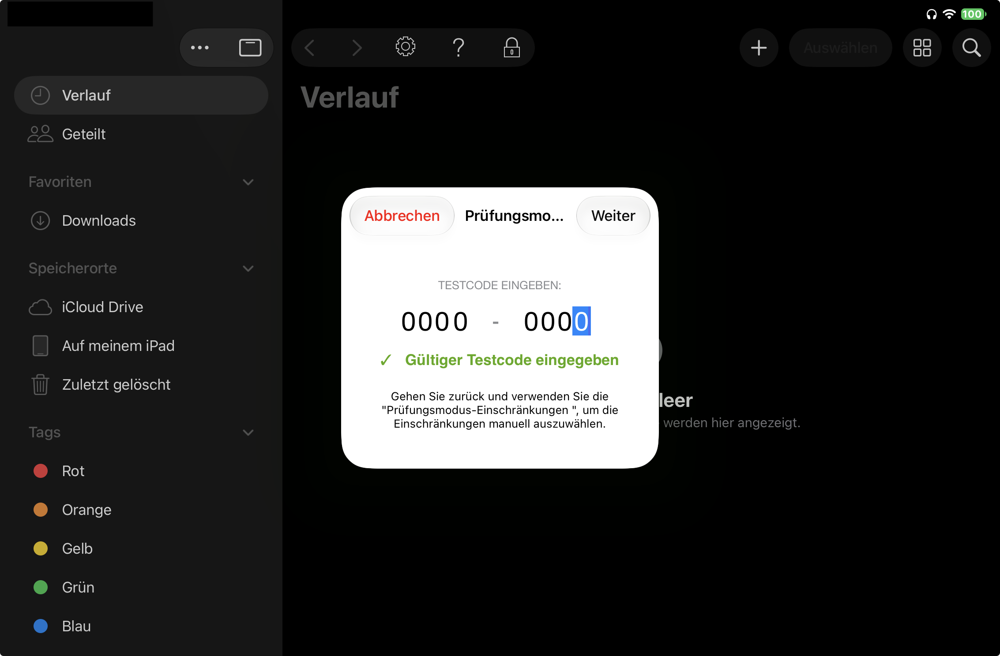{ loading=lazy }](../img/Testcode2.png)

    [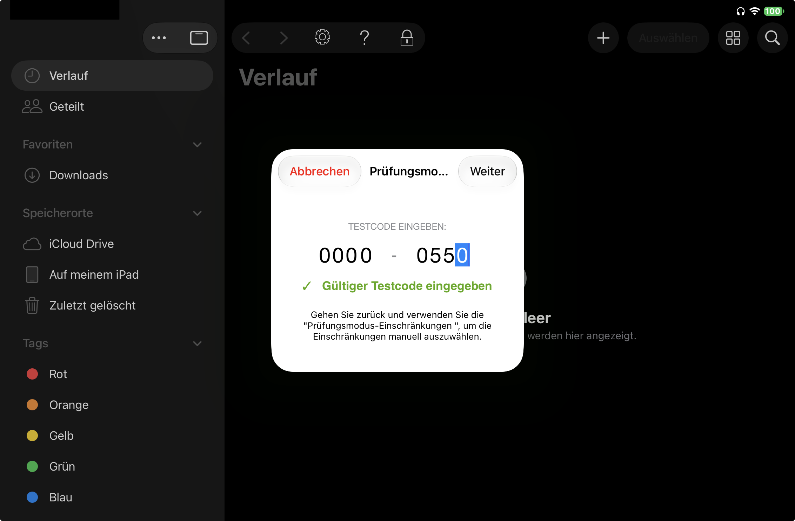{ loading=lazy }](../img/Testcode3.png)

3. Tippe auf **Weiter** und kontrolliere die Zusammenfassung. Achte besonders auf die Winkeleinheit, den CAS-Modus und die Einschränkungen. Im folgenden Beispiel ist CAS ausgeschaltet; das ist keine allgemeine Vorgabe für eure Klausur.

    [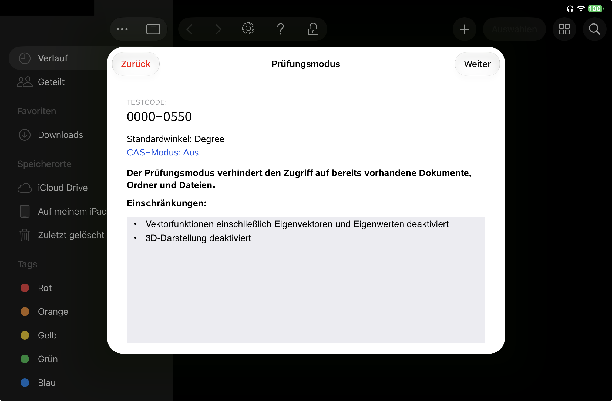{ loading=lazy }](../img/Testcode4.png)

4. Tippe erneut auf **Weiter**. Bestätige die Meldung **Einschränkung durch App bestätigen** mit **Ja**. Je nach Version heißt sie auch **App-Selbstsperre bestätigen**.

    [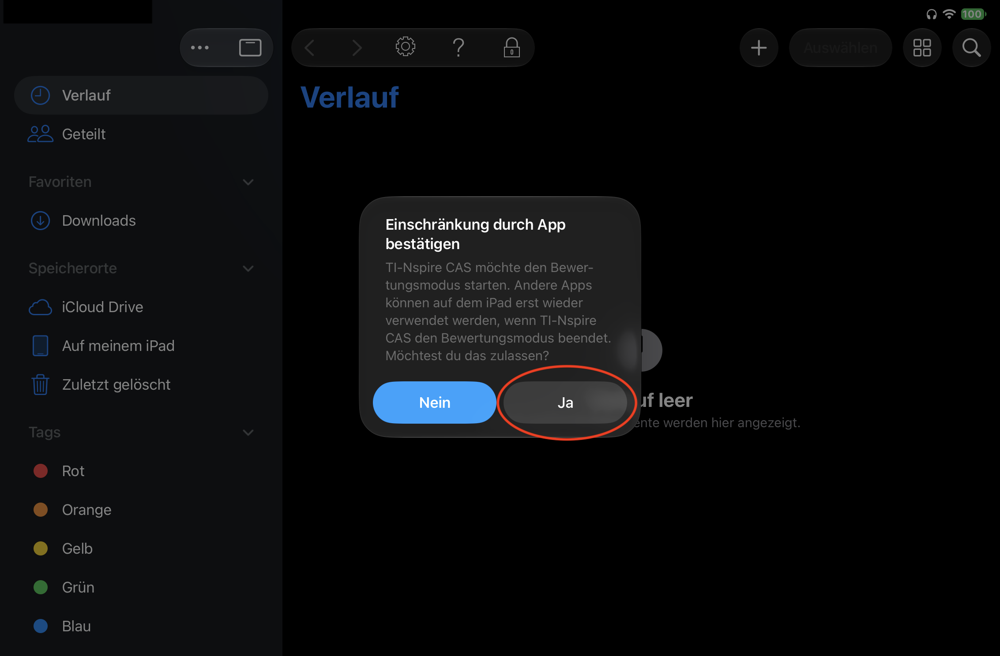{ loading=lazy }](../img/modus1.png)

Den Ablauf zeigt die [TI-Anleitung zur Eingabe eines Testcodes](https://education.ti.com/html/eguides/nspire/EG_Nspire/DE/content/eg_ipadapp/m_testmode/tm_entertestcode.HTML).

### Ohne Testcode

1. Wähle **Prüfungsmodus-Einschränkungen wählen**.
2. Stelle die Winkeleinheit (**Grad** oder **Radiant**) nach Vorgabe ein.
3. Wähle den vorgegebenen **CAS-Modus** und die weiteren Einschränkungen.
4. Tippe auf **Weiter** und bestätige die App-Selbstsperre mit **Ja**.

Bei **CAS-Modus: Ein** stehen symbolische Berechnungen zur Verfügung. **Exakt arithmetisch** ermöglicht exakte Ergebnisse wie Brüche und Wurzeln; **Aus** deaktiviert CAS und exakte Ergebnisse. Welche Einstellung du brauchst, legt deine Lehrkraft fest.

Die Optionen erläutert die [TI-Anleitung zur Auswahl der Einschränkungen](https://education.ti.com/html/eguides/nspire/EG_Nspire/DE/content/eg_ipadapp/m_testmode/tm_enterchooserestrictions.HTML).

## Woran erkenne ich den aktiven Prüfungsmodus?

Nach dem Start erscheint eine **grüne Titelleiste**. Dort siehst du unter anderem den Testcode und die bereits verstrichene Zeit. Über das Informationssymbol kannst du die Einstellungen kontrollieren. Lass deine Lehrkraft den Modus zu Beginn überprüfen.

Tippe auf **+** und wähle **Calculator**, um eine Seite zum Rechnen zu öffnen:

[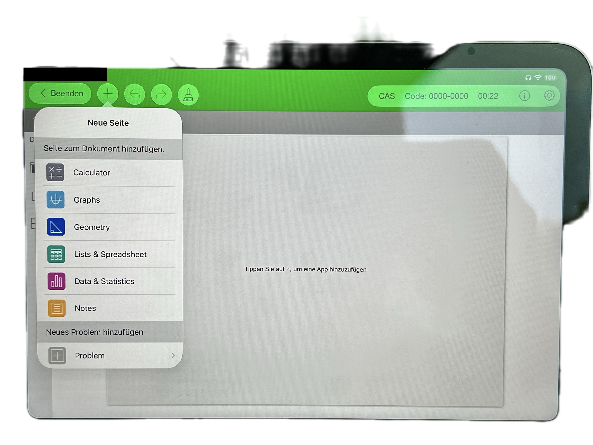{ loading=lazy }](../img/modus2.png)

Wenn ein vertrauter Befehl nicht verfügbar ist, kann das an den gewählten Einschränkungen liegen. Melde dich in diesem Fall bei deiner Lehrkraft.

## Prüfungsmodus beenden

Beende den Modus erst, wenn deine Lehrkraft dich dazu auffordert.

1. Tippe oben links auf **Beenden**.
2. Bestätige die Frage **Prüfungsmodus verlassen** mit **Ja**.

    [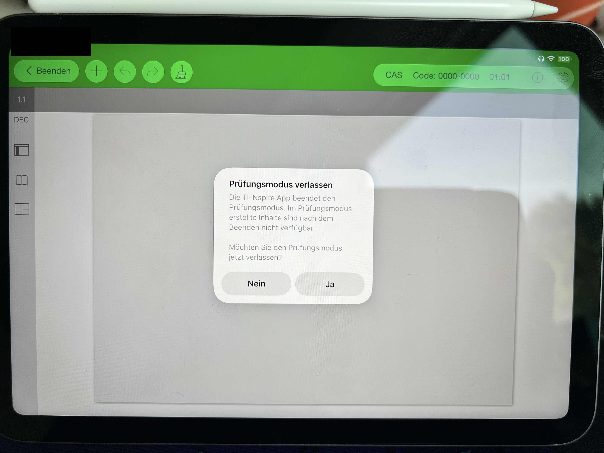{ loading=lazy }](../img/modus3.png)

3. Zeige bei Bedarf die **Prüfungsmodus-Zusammenfassung** vor. Sie enthält unter anderem den Testcode sowie Start- und Endzeit.
    [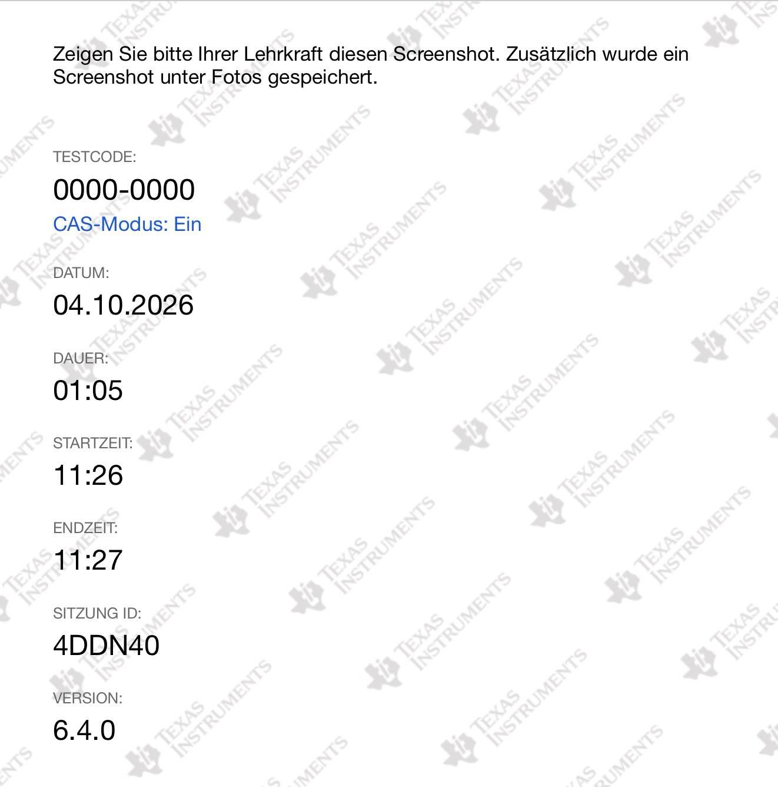{ loading=lazy }](../img/ende.png)

4. Tippe auf **Fertig**. Die Zusammenfassung wird im Fotoalbum des iPads gespeichert.

!!! warning "Die Rechnungen der Prüfung werden gelöscht"
    Beim Beenden wird das temporäre Dokument aus der Prüfung gelöscht. Übertrage benötigte Ergebnisse vorher auf deinen Prüfungsbogen. Deine Dokumente aus der Zeit vor der Prüfung bleiben erhalten; die vorherigen Dokumenteinstellungen werden wiederhergestellt.

Weitere Details findest du in der [TI-Anleitung zum Beenden des Prüfungsmodus](https://education.ti.com/html/eguides/nspire/EG_Nspire/DE/content/eg_ipadapp/m_testmode/tm_exittestmode.HTML).

## Checkliste zum Prüfungsbeginn

- Ist mein iPad ausreichend geladen?
- Stimmt der Testcode mit der Vorgabe überein?
- Sind Winkeleinheit und CAS-Modus richtig eingestellt?
- Ist die grüne Titelleiste sichtbar?
- Hat meine Lehrkraft die Einstellungen überprüft?
